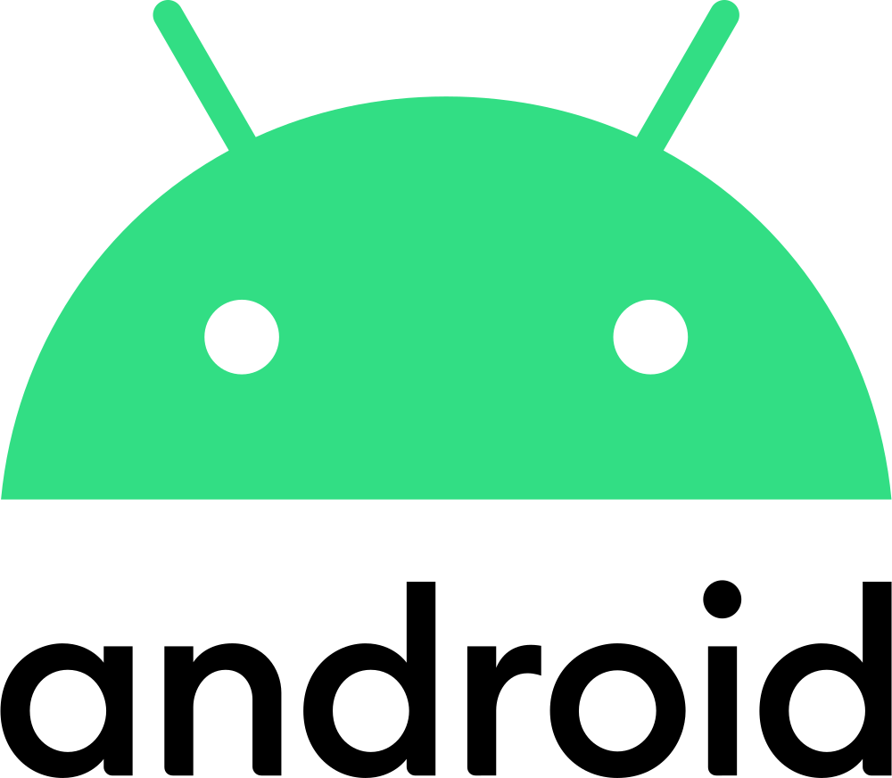

<!-- PROJECT LOGO -->
 

  

<h2 align="center">MotoVoice App</h2>

  

    A simple voice communication app for motorcycle intercoms.
     
     
    
      
      
      
    

    <a href="https://github.com/motovoice/app/issues">Report a bug</a>
  

## Disclaimer
I built MotoVoice mainly for myself, but decided to share it with everyone.
Due to the fact, that I'm writing this app in my free time as a hobby, I can not garantue fast responses to issues or feature request. But I will do my best helping where I can.

<!-- ABOUT THE PROJECT -->

## About The Project
MotoVoice brings voice communication over IP to every intercom or headset.
Create a voice channel and invite your friends via QR-Code or link.
A channel is valid for 24 hours. After this, the channel gets automatically deleted.

## Reason behind the project
I ride motorcycles in my free time and was connecting with friends via bluetooth intercoms while doing so. But I was not satisfied with the audio quality and the range of the intercoms. Also if people have different intercoms like Sena/Cardo..., there were always problems. So I decided to build an IP based solution which is easy to use and works with all intercoms/headsets.

## Server
Currently you have to host the server yourself. The code is available [here](https://github.com/motovoice/server)

## Benefits
These are the main benefits to direct bluetooth intercom connections:

- Better voice quality
- Nearly unlimited participants (depends on the server)
- Unlimited range
- Encrypted traffic to the server
- Interoperability, it doesn't matter if you use SENA, Cardo and so on
- Faster reconnect on connection loss
- Channel overview of participants

## Tradeoffs
There are a few tradeoffs in comparison to direct bluetooth intercom connections:

- Phone required
- [Server](https://github.com/motovoice/server) required
- You need a internet connection, if mobile data is interrupted (e.g. in a tunnel) the app tries to reconnect
- Possibly a little bit higher voice latency depending on the server location
- Mobile data usage, you can expect about 20MB per hour, depending on usage and group size
  - You can turn on data saving in the app to reduce the bitrate by half

## Languages
The app is currently available in German and English.

## Contribution
I'm open to any suggestions, but when it comes to new features, I want to keep the app as simple as possible and focus on its core functions.

## This project uses AI-assisted development tools
Due to the fact that I'm pretty new to mobile development, a lot of code is written by Claude. But I always review the code myself.

### Tools
- Claude Code (Anthropic) · claude-sonnet-4-6

### Oversight
Human and AI co-author decisions; human reviews all output.

<!-- LICENSE -->

## License

Distributed under the AGPL-3.0 license. See `LICENSE` for more information.

Helmet Icon: [Flaticon](https://www.flaticon.com/free-icons/helmet)

Voice Icon: [Flaticon](https://www.flaticon.com/free-icons/voice-message)
